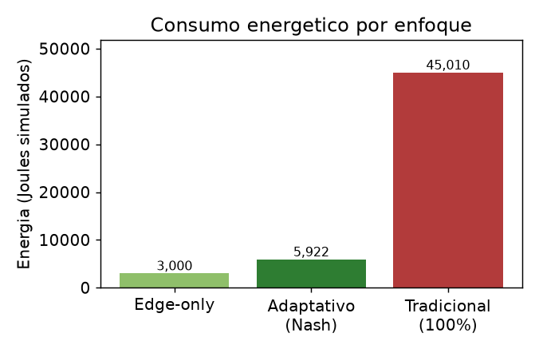
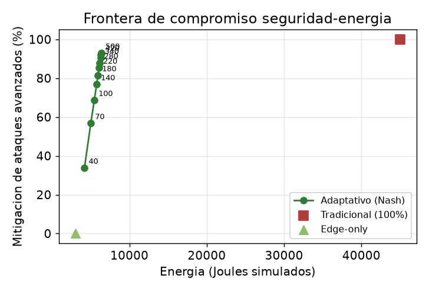

<!-- _class: lead -->

# Stochastic Green Edge (SGE)

## Defensa Adaptativa de APIs en el Borde mediante Teoría de Juegos y Cómputo Verde

**Seguridad máxima con energía mínima**

<br>

<span class="small">Ciberseguridad Cloud · Computación Sostenible · Teoría de Juegos</span>

<!--
Nota para exponer: preséntate, di el nombre del proyecto y la idea de una frase:
"Un sistema que decide, petición por petición, cuándo vale la pena gastar mucha
energía en revisar el tráfico a fondo, usando teoría de juegos."
-->

---

## Índice

1. **El problema**: seguridad vs. energía
2. **La idea** de SGE
3. **Teoría**: el juego Defensor–Atacante
4. **Matemática**: utilidad, sospecha, matrices y Nash
5. **Arquitectura**: capa Edge + capa Serverless
6. **El demo**: simulación y código
7. **Resultados** y análisis del ahorro
8. **Limitaciones** y conclusiones

---

## 1. El problema

Una API pública recibe tráfico mezclado:

- 🟢 **Usuarios legítimos** (la mayoría)
- 🤖 **Bots ruidosos** (ataques ligeros, fáciles de frenar)
- 🥷 **Ataques dirigidos** (avanzados, sigilosos, disfrazados)

La práctica habitual: **inspeccionar el 100% del tráfico a fondo.**

| | Ventaja | Costo |
|---|---|---|
| Inspección total | Máxima seguridad | <span class="bad">Energía enorme y constante (CPU, Joules, CO₂)</span> |

> **Tensión central:** más seguridad ⇒ más energía. En conflicto directo con el **cómputo verde**.

<!--
Recalca: revisar todo es seguro pero derrochador. El 95% del tráfico no justifica
ese gasto. El reto es bajar la energía sin perder seguridad.
-->

---

## 2. La idea de SGE

> **No revises todo por igual. Revisa a fondo solo lo sospechoso, y decide "qué es sospechoso" con un modelo matemático óptimo.**

El nombre resume las tres ideas:

| Término | Significado |
|---|---|
| **S**tochastic | Decisiones bajo **incertidumbre** (no sabemos qué es cada petición) |
| **G**reen | Minimizar **energía** / huella de carbono |
| **E**dge | Todo ocurre en el **borde**, cerca del usuario |

**Meta:** capturar *casi toda* la seguridad con una *fracción* de la energía.

---

## 3. Teoría — Un juego de dos jugadores

Modelamos la decisión como un **juego estocástico no cooperativo con información imperfecta**.

**Defensor** (el sistema) — 2 acciones:
- `D_V` (**Verde**): quedarse en el Edge. Barato, superficial.
- `D_A` (**Activa**): escalar a inspección profunda. Caro, certero.

**Atacante** — 2 acciones:
- `A_L` (**Ligero**): bot ruidoso, fácil de detectar.
- `A_M` (**Avanzado**): dirigido y sigiloso; **solo lo detecta la inspección profunda**.

<span class="cite">Marco clásico de seguridad: Alpcan & Başar (2010); Manshaei et al. (2013).</span>

---

## 3. El conflicto que no tiene solución fija

|  | Atacante ligero `A_L` | Atacante avanzado `A_M` |
|---|---|---|
| **Defensor Verde `D_V`** | <span class="ok">✅ Lo bloqueo barato</span> | <span class="bad">❌ Se cuela → brecha</span> |
| **Defensor Activo `D_A`** | ⚠️ Gasté de más | <span class="ok">✅ Lo detecto</span> |

- El **Defensor** quiere ir barato contra ligeros, pero caro contra avanzados.
- El **Atacante** quiere ser avanzado si el defensor va barato, pero ligero si va caro (no malgasta esfuerzo si lo van a atrapar igual).

> Estructura *matching pennies* → **no existe equilibrio en estrategias puras.**
> La solución óptima es **aleatorizar**: jugar `D_V` con probabilidad `p` y `D_A` con `1−p`.

---

## 4. Matemática — Función de utilidad del Defensor

$$
U_D(a, d) = \alpha\, R(a,d) \;-\; \beta\, C_{\text{energy}}(d) \;-\; \gamma\, C_{\text{damage}}(a,d)
$$

| Término | Significado | Efecto |
|---|---|---|
| $R(a,d)$ | Recompensa por acertar | suma |
| $C_{\text{energy}}(d)$ | Costo energético (**verde**) | resta |
| $C_{\text{damage}}(a,d)$ | Daño si un ataque se cuela (**seguridad**) | resta fuerte |
| $\alpha,\beta,\gamma$ | Pesos de importancia | configurables |

**Costos energéticos (unidades relativas):**

$$
C_{\text{edge}} = 1 \quad\ll\quad C_{\text{exec}} = 15 \quad<\quad C_{\text{cold}} = 25
$$

<span class="cite">Costos serverless: Castro et al. (2019). Cómputo verde: Murugesan & Gangadharan (2012); Radu (2017).</span>

---

## 4. Puntuación de sospecha (información imperfecta)

El Defensor **no sabe** la clase real; solo infiere una sospecha $s \in [0,1]$:

$$
s = 0.15\,\phi_{\text{ip}} + 0.15\,\phi_{\text{ua}} + 0.70\,\phi_{\text{payload}}, \qquad \phi_{\text{ip}} = 1 - e^{-\text{freq}/6}
$$

El **payload pesa 0.70** porque es lo único que solo la inspección profunda resuelve.

```python
# sge/game_theory.py
def suspicion_score(features, config):
    freq_component = 1.0 - np.exp(-features.ip_frequency / 6.0)
    raw = (0.15 * freq_component
           + 0.15 * features.user_agent_anomaly
           + 0.70 * features.payload_anomaly)
    return float(np.clip(raw, 0.0, 1.0))
```

> La sospecha modula el riesgo $\rho = s_0 + (1-s_0)\,s$ ⇒ **el juego es distinto para cada petición.**

---

## 4. Matrices de pago (ejemplo real, $s = 0.83$)

$$
\mathbf{A}_{\text{Defensor}}=\begin{pmatrix} 9.00 & -120.95\\ -3.00 & -3.00 \end{pmatrix}
\qquad
\mathbf{B}_{\text{Atacante}}=\begin{pmatrix} -5.00 & 151.35\\ -5.00 & -35.00 \end{pmatrix}
$$

Interpretación de la matriz del Defensor (filas `D_V,D_A` · columnas `A_L,A_M`):

- `(D_V, A_L) = +9`  → barato + ligero: bloqueo en Edge ✅
- `(D_V, A_M) = −120.95` → barato + avanzado: **brecha** ❌
- `(D_A, ·) = −3` → escalé: recompensa 12 − energía 15

```python
# sge/game_theory.py — build_payoff_matrices (extracto)
A_def = np.array([
    [a*config.reward_edge_block - b*c_edge,        # (D_V, A_L)
     -b*c_edge - g*damage],                        # (D_V, A_M): brecha
    [a*config.reward_deep_detect - b*c_srv,        # (D_A, A_L)
     a*config.reward_deep_detect - b*c_srv],       # (D_A, A_M)
])
```

---

## 4. El principio de indiferencia

> En el equilibrio, cada jugador aleatoriza para que su rival quede **indiferente** entre sus dos acciones (así no puede explotarlo).

Igualando $\mathbb{E}[U_D \mid D_V] = \mathbb{E}[U_D \mid D_A]$ se obtiene el **núcleo del proyecto**:

$$
\underbrace{\beta\,(C_{\text{serverless}} - C_{\text{edge}})}_{\text{sobrecosto de inspeccionar}}
=
\underbrace{\gamma\,(1-q)\,C_{\text{damage}} + \Delta R}_{\text{daño evitado + ganancia de detección}}
$$

**El Joule marginal invertido iguala a la seguridad marginal obtenida.**
Ni sobre-inspecciona (Joules sin retorno) ni sub-inspecciona (daño evitable).

Probabilidad óptima de ir Verde (hace indiferente al Atacante):

$$
p = \frac{B_{D_A,A_M} - B_{D_A,A_L}}{(B_{D_V,A_L}-B_{D_A,A_L}) - (B_{D_V,A_M}-B_{D_A,A_M})}
$$

---

## 4. El solucionador en código

```python
# sge/game_theory.py — equilibrio completamente mixto (indiferencia)
def _interior_mixed(A_def, B_att):
    # p hace INDIFERENTE al Atacante entre A_L y A_M
    denom_p = (B_att[0,0]-B_att[1,0]) - (B_att[0,1]-B_att[1,1])
    p = (B_att[1,1] - B_att[1,0]) / denom_p
    # q hace INDIFERENTE al Defensor entre D_V y D_A
    denom_q = (A_def[0,0]-A_def[0,1]) - (A_def[1,0]-A_def[1,1])
    q = (A_def[1,1] - A_def[0,1]) / denom_q
    if 0 <= p <= 1 and 0 <= q <= 1:
        return p, q
    return None
```

**Enumeración de soportes:** 1) equilibrio mixto interior → 2) estrategias puras → 3) maximin (respaldo).

> Dato notable: $p$ depende de la matriz del **Atacante** → es el *incentivo del adversario* lo que fija cuánto aleatorizar.

---

## 4. Ejemplo resuelto (salida real del demo)

```text
$ python main.py --demo-nash

--- DEMO: Equilibrio de Nash para una peticion sospechosa (A_M) ---
Sospecha (s)    : 0.831
Tipo equilibrio : mixed
Estrategia Defensor: P(D_V)=0.161  P(D_A)=0.839
Estrategia Atacante: P(A_L)=0.908  P(A_M)=0.092
```

**Traducción:** ante una petición muy sospechosa, el modelo prescribe **escalar a inspección profunda el 83.9% de las veces**, concentrando la energía cara donde hay riesgo.

Para tráfico benigno, esa probabilidad cae casi a cero (ver Figura 3).

---

## 5. Arquitectura — dos capas asimétricas

```
        Petición HTTP
             │
             ▼
 ┌───────────────────────────────┐
 │  CAPA EDGE   (costo = 1)       │
 │  · Métricas baratas            │
 │  · Rate-limiting (frena bots)  │
 │  · Cerebro matemático (Nash)   │
 └──────────────┬────────────────┘
                │ solo si Nash dice "escala" (prob. 1−p)
                ▼
 ┌───────────────────────────────┐
 │  CAPA SERVERLESS (15 / 25)     │
 │  · Inspección profunda         │
 │  · Detecta CUALQUIER ataque    │
 │  · Penalización de cold start  │
 └───────────────────────────────┘
```

---

## 5. La decisión del Edge (código)

```python
# sge/edge.py — decide()
# 1) Bot ruidoso → rate-limiting barato (sin ejecutar el juego)
if features.user_agent_anomaly >= 1.0 and features.ip_frequency > self._edge_block_ip_frequency:
    return EdgeDecision(..., escalate=False, edge_blocked=True)

# 2) Claramente benigno → fast-path verde
if s < self._fast_path_threshold:
    return EdgeDecision(..., escalate=False)

# 3) Sospechoso → resolver Nash y muestrear la estrategia mixta
nash = solve_for_request(features, self._config, serverless_cold)
escalate = self._rng.random() >= nash.p_green   # ← moneda cargada
action = DefenderAction.ACTIVE if escalate else DefenderAction.GREEN
```

> La línea `self._rng.random() >= nash.p_green` es donde **la teoría se convierte en acción**.

---

## 6. El demo — generación de tráfico

Mezcla realista: **80% legítimo · 15% bots (`A_L`) · 5% avanzados (`A_M`)**.

```python
# sge/simulation.py — generate_traffic (extracto)
if cls == TrafficClass.LEGIT:
    ip, ua = ip_diversa, navegador_real
    payload = "GET /api/v1/resource?id=..."         # pequeño y limpio
elif cls == TrafficClass.LIGHT_ATTACK:
    ip = f"198.51.100.{rng.integers(1,6)}"          # pocas IPs → alta frecuencia
    ua = _BOT_UAS[...]                               # curl, sqlmap...
else:  # ADVANCED_ATTACK
    ua = _LEGIT_UAS[...]                             # se disfraza de navegador
    payload = "POST /api/v1/data " + "A"*3000 + " '; DROP TABLE users; --"
```

> Cada petición lleva su etiqueta real, pero **el defensor nunca la mira** (información imperfecta).

---

## 6. El demo — bucle de simulación

```python
# sge/simulation.py — run_simulation (lógica central)
decision = edge.decide(request, serverless_cold=cold)

if decision.action == DefenderAction.ACTIVE:      # escaló
    result = serverless.inspect(request, step)    # detecta TODO
    if result.threat_detected:
        report.attacks_mitigated += 1
else:                                              # se quedó Verde
    if request.true_class == LIGHT_ATTACK:
        report.attacks_mitigated += 1             # bot frenado en Edge
    elif request.true_class == ADVANCED_ATTACK:
        report.breaches += 1                      # ← avanzado se cuela
```

Al final compara la **energía adaptativa** contra la **línea base tradicional** (100% inspección).

---

## 7. Resultados (semilla 7, 2000 peticiones)

| Enfoque | Mit. global | Mit. avanzados | Energía (J) |
|---|---|---|---|
| Tradicional (100%) | 100% | 100% | 30,010 |
| **Adaptativo (Nash)** | <span class="ok">**94.38%**</span> | **78.95%** | <span class="ok">**4,225**</span> |
| Edge-only (0%) | 75.53% | <span class="bad">0%</span> | 2,000 |

> **94.38% de mitigación global** (100% de los bots) con **85.9% menos energía** que revisar todo.

Robustez sobre 20 semillas: avanzados $81.6\% \pm 4.2\%$ · ahorro $86.8\% \pm 0.5\%$.

<span class="cite">Edge-only demuestra que "ir siempre barato" deja pasar el 100% de los ataques avanzados: la capa cara es imprescindible.</span>

---

## 7. ¿Por qué es tan eficiente?

De 2000 peticiones, **solo 107 (5.35%) escalaron** a Serverless.

$$
E_{\text{adaptativa}} = \underbrace{2000}_{\text{Edge } (1\times2000)} + \underbrace{2225}_{107 \text{ invocaciones}} = 4225 \text{ J}
$$

$$
E_{\text{tradicional}} = 25 + 1999\times 15 = 30010 \text{ J}
$$

- 80% legítimo → *fast-path*, nunca escala (costo 1).
- 15% bots → *rate-limiting* en el borde (costo 1).
- ~5% sospechoso → único que paga la inspección profunda.

> El equilibrio de Nash **reserva el gasto caro para donde de verdad aporta valor.**

---

## 7. Figuras del paper

<div class="small">

- **Fig 1** — Consumo energético por enfoque: el Adaptativo se sitúa cerca del piso del Edge-only y muy por debajo del Tradicional.
- **Fig 2** — Frontera de Pareto seguridad–energía: al subir el valor de la API, el modelo prescribe más escalado y más mitigación, siempre un orden de magnitud por debajo del Tradicional en energía.
- **Fig 3** — Respuesta dinámica: la probabilidad de escalar $1-p$ crece monótonamente con la sospecha $s$.

</div>

 

<span class="cite">Generadas de forma reproducible por `paper/run_experiments.py` (20 semillas).</span>

---

## 8. Limitaciones (honestidad crítica)

- La inspección Serverless es **idealizada** (detección perfecta): faltan falsos positivos/negativos.
- Cada petición es una **etapa independiente**: un juego multi-etapa con estado (reputación de IP) daría políticas con memoria.
- La sospecha usa **heurísticas**; aprenderla de datos reales la calibraría mejor.
- Las energías son **unidades relativas** simuladas, no mediciones físicas.

> Reconocerlas no debilita el trabajo: delimita su alcance y define el trabajo futuro.

---

## 8. Conclusiones

- Formulamos la defensa perimetral como un **juego estocástico** y la resolvemos con el **equilibrio de Nash en estrategias mixtas**.
- El **principio de indiferencia** iguala analíticamente el Joule invertido con la seguridad ganada.
- Empíricamente: **94.38% de mitigación** con **85.9% de ahorro energético**.
- La teoría de juegos concilia **ciberseguridad** y **sostenibilidad**.

**Trabajo futuro:** juego multi-etapa con estado; aprender la función de sospecha y los pesos de utilidad a partir de trazas reales.

---

<!-- _class: lead -->

# ¡Gracias!

## ¿Preguntas?

<br>

**Stochastic Green Edge (SGE)**
*Seguridad máxima con energía mínima*

<span class="small">Código: `main.py`, `sge/` · Paper: `paper/paper.pdf` · Pruebas: 13 en Pytest ✅</span>
